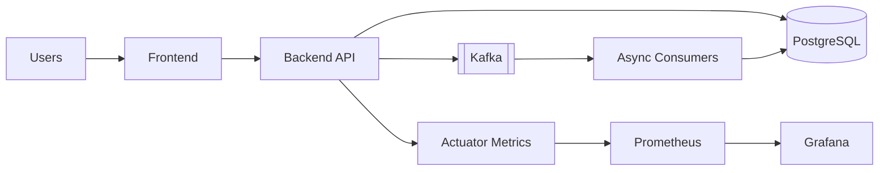

# SourceFeed

SourceFeed is an event-driven social feed app with a Spring Boot backend and a React frontend.
Users can register, follow other users, create posts, and fetch personalized timelines that are materialized asynchronously through Kafka.

## Features

- JWT-based authentication
- Follow/unfollow relationships
- Post creation and timeline fan-out via Kafka
- Cursor and page-based feed retrieval
- Notification and verification consumers
- Metrics endpoint for Prometheus (`/actuator/prometheus`)

## Tech Stack

- Backend: Java 17, Spring Boot 3.2.0, Spring Kafka, JPA, Flyway
- Frontend: React 18 + Vite 5 + Tailwind
- Database: PostgreSQL
- Message Broker: Apache Kafka
- Observability: Spring Actuator, Prometheus, Grafana provisioning
- Load Testing: k6 (`load-tests/social-feed-load.js`)

## Project Structure

```text
backend/         Spring Boot API and consumers
frontend/        React + Vite UI
grafana/         Provisioned datasource and dashboards
load-tests/      k6 scripts
prometheus.yml   Prometheus scrape configuration
```

## Architecture



## Environment Setup

Backend env template: `backend/.env.example`

1. Copy templates:

```powershell
copy backend\.env.example backend\.env
copy frontend\.env.example frontend\.env
```

2. Fill required secrets in `backend/.env`:

- `SPRING_DATASOURCE_URL`, `SPRING_DATASOURCE_USERNAME`, `SPRING_DATASOURCE_PASSWORD`
- `SPRING_KAFKA_BOOTSTRAP_SERVERS`
- `JWT_SECRET`
- Optional AI providers: `HF_SPACES_URL`, `HF_API_KEY`, `GROQ_API_KEY`

## Run Locally

Start PostgreSQL and Kafka first (locally or with your own containers), then:

### Backend

```powershell
cd backend
mvn clean install
mvn spring-boot:run
```

Backend default URL: `http://localhost:8080`

### Frontend

```powershell
cd frontend
npm install
npm run dev
```

Frontend default URL: `http://localhost:5173`

## Monitoring

- Prometheus config: `prometheus.yml`
- Grafana provisioning: `grafana/provisioning/`
- Backend metrics endpoint: `http://localhost:8080/actuator/prometheus`


## Load Testing

Install k6 and run:

```powershell
k6 run load-tests/social-feed-load.js
```
