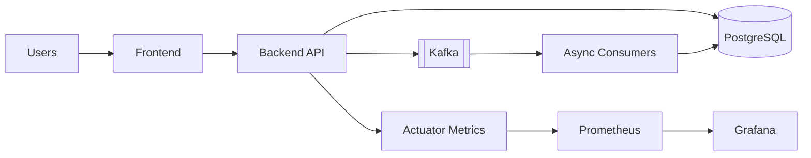

# SourceFeed

SourceFeed is an event-driven social feed app with a Spring Boot backend and a React frontend.
Users can register, follow other users, create posts, and fetch personalized timelines that are materialized asynchronously through Kafka.

## Features

- JWT-based authentication
- Follow/unfollow relationships
- Post creation and timeline fan-out via Kafka
- Cursor and page-based feed retrieval
- Notification and verification consumers
- Metrics endpoint for Prometheus (`/actuator/prometheus`)

## Tech Stack

- Backend: Java 17, Spring Boot 3.2.0, Spring Kafka, JPA, Flyway
- Frontend: React 18 + Vite 5 + Tailwind
- Database: PostgreSQL
- Message Broker: Apache Kafka
- Observability: Spring Actuator, Prometheus, Grafana provisioning
- Load Testing: k6 (`load-tests/social-feed-load.js`)

## Project Structure

```text
backend/         Spring Boot API and consumers
frontend/        React + Vite UI
grafana/         Provisioned datasource and dashboards
load-tests/      k6 scripts
prometheus.yml   Prometheus scrape configuration
```

## Architecture


```mermaid
flowchart LR
    U[Users] --> FE[Frontend]
    FE --> API[Backend API]
    API --> DB[(PostgreSQL)]
    API --> K[[Kafka]]
    K --> C[Async Consumers]
    C --> DB
    API --> M[Actuator Metrics]
    M --> P[Prometheus]
    P --> G[Grafana]
```

## Environment Setup

Backend env template: `backend/.env.example`

1. Copy templates:

```powershell
copy backend\.env.example backend\.env
copy frontend\.env.example frontend\.env
```

2. Fill required secrets in `backend/.env`:

- `SPRING_DATASOURCE_URL`, `SPRING_DATASOURCE_USERNAME`, `SPRING_DATASOURCE_PASSWORD`
- `SPRING_KAFKA_BOOTSTRAP_SERVERS`
- `JWT_SECRET`
- Optional AI providers: `HF_SPACES_URL`, `HF_API_KEY`, `GROQ_API_KEY`

## Run Locally

Start PostgreSQL and Kafka first (locally or with your own containers), then:

### Backend

```powershell
cd backend
mvn clean install
mvn spring-boot:run
```

Backend default URL: `http://localhost:8080`

### Frontend

```powershell
cd frontend
npm install
npm run dev
```

Frontend default URL: `http://localhost:5173`

## Monitoring

- Prometheus config: `prometheus.yml`
- Grafana provisioning: `grafana/provisioning/`
- Backend metrics endpoint: `http://localhost:8080/actuator/prometheus`


## Load Testing

Install k6 and run:

```powershell
k6 run load-tests/social-feed-load.js
```

## EC2 Deployment

The backend is container-ready, so the simplest EC2 setup is Docker Compose on a single instance. The repo includes a deployment stack in `deploy/docker-compose.ec2.yml` that runs the backend, PostgreSQL, Kafka, Zookeeper, Prometheus, and Grafana together.

### 1. Prepare the EC2 instance

Use an Amazon Linux 2023 or Ubuntu EC2 instance with at least 2 vCPU and 4 to 8 GB RAM. Open these inbound ports in the security group:

- `22` for SSH
- `8080` for the backend API
- `3000` for Grafana
- `9090` for Prometheus if you want direct access

Keep `5432` and `9092` closed unless you explicitly need direct database or broker access.

### 2. Install Docker and Compose

On Ubuntu:

```bash
sudo apt-get update
sudo apt-get install -y docker.io docker-compose-plugin
sudo usermod -aG docker ubuntu
sudo systemctl enable --now docker
```

### 3. Configure environment variables

Copy `deploy/.env.example` to `deploy/.env` and set real values for:

- `POSTGRES_PASSWORD`
- `JWT_SECRET`
- `GRAFANA_ADMIN_PASSWORD`

If your frontend will call the EC2 backend directly, set `CORS_ALLOWED_ORIGINS` to your frontend origin.

### 4. Start the stack

From the repository root:

```bash
docker compose --env-file deploy/.env -f deploy/docker-compose.ec2.yml up -d --build
```

### 5. Verify

- Backend health: `http://<EC2_PUBLIC_IP>:8080/actuator/health`
- Prometheus: `http://<EC2_PUBLIC_IP>:9090`
- Grafana: `http://<EC2_PUBLIC_IP>:3000`

Grafana is already wired to Prometheus through the provisioning files in `grafana/provisioning/`.
